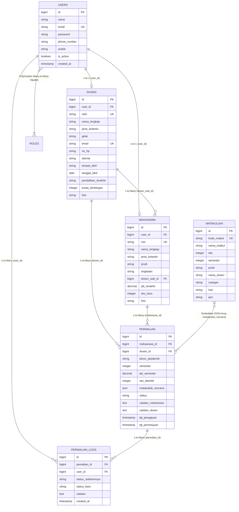

# 📘 MASTER TUTORIAL & DOKUMENTASI LENGKAP BACKEND (LARAVEL 10 / PHP 8.1 API)

**Sistem Pencatatan Perwalian Mahasiswa STMIK Bandung**

Dokumen ini merupakan **Buku Panduan Teknis & Tutorial Komprehensif** untuk seluruh arsitektur, fitur, dan komponen yang ada di Backend Laravel 10. Dibuat dengan standar industri *software house* menggunakan **Clean Architecture (Repository & Service Pattern)**, **PostgreSQL**, **Laravel Sanctum**, **Spatie Permission**, **Swagger OpenAPI**, dan **PHPUnit Test**.

---

## 📑 DAFTAR ISI TUTORIAL BACKEND

1. [Arsitektur Clean Architecture & Alur Eksekusi Kode](#1-arsitektur-clean-architecture--alur-eksekusi-kode)
2. [Panduan Instalasi & Konfigurasi Lingkungan (Environment)](#2-panduan-instalasi--konfigurasi-lingkungan-environment)
3. [Tutorial Database PostgreSQL, Migrasi & Seeder Data](#3-tutorial-database-postgresql-migrasi--seeder-data)
4. [Tutorial Autentikasi Sanctum & Role Permission Spatie](#4-tutorial-autentikasi-sanctum--role-permission-spatie)
5. [Tutorial Lapisan Repository & Service Pattern (Aturan Bisnis)](#5-tutorial-lapisan-repository--service-pattern-aturan-bisnis)
6. [Tutorial Validasi Form Request & JSON API Transformer (Resource)](#6-tutorial-validasi-form-request--json-api-transformer-resource)
7. [Tutorial Alur Kerja (Workflow) Inti Perwalian & Audit Log](#7-tutorial-alur-kerja-workflow-inti-perwalian--audit-log)
8. [Tutorial Modul Mata Kuliah (Matakuliah CRUD)](#8-tutorial-modul-mata-kuliah-matakuliah-crud)
9. [Tutorial Manajemen User & Integrasi Otomatis Mahasiswa/Dosen](#9-tutorial-manajemen-user--integrasi-otomatis-mahasiswadosen)
10. [Tutorial Export/Import Data Perwalian (Scoped Per Role)](#10-tutorial-exportimport-data-perwalian-scoped-per-role)
11. [Tutorial Penanganan Error Terpusat (Exception Handler)](#11-tutorial-penanganan-error-terpusat-exception-handler)
12. [Tutorial Lengkap Swagger OpenAPI (Install, Anotasi, UI Web)](#12-tutorial-lengkap-swagger-openapi-install-anotasi-ui-web)
13. [Tutorial Pengujian Otomatis (PHPUnit Feature Tests)](#13-tutorial-pengujian-otomatis-phpunit-feature-tests)
14. [Standar Format Kode & Trait API Response](#14-standar-format-kode--trait-api-response)

---

## 🏛️ 1. ARSITEKTUR CLEAN ARCHITECTURE & ALUR EKSEKUSI KODE

Aplikasi tidak menumpuk logika di Controller, melainkan membaginya menjadi lapisan-lapisan independen (*Separation of Concerns*):

```
[HTTP Request dari Frontend/Postman/Swagger]
         │
         ▼
[1. Routes (routes/api.php)] ──▶ Menerapkan Middleware (Sanctum, Role Spatie)
         │
         ▼
[2. Form Requests (app/Http/Requests/)] ──▶ Validasi input & pesan kesalahan Bahasa Indonesia
         │
         ▼
[3. Controllers (app/Http/Controllers/Api/v1/)] ──▶ Menerima request & memanggil Service
         │
         ▼
[4. Services Layer (app/Services/)] ──▶ Aturan Bisnis Inti (Validasi status Pending, Log Audit, dll)
         │
         ▼
[5. Repositories Layer (app/Repositories/Eloquent/)] ──▶ Query Database (ILIKE search, Eloquent ORM)
         │
         ▼
[6. Eloquent Models (app/Models/)] ──▶ Representasi Tabel PostgreSQL
         │
         ▼
[7. API Resources (app/Http/Resources/)] ──▶ Transformasi struktur JSON standar
         │
         ▼
[HTTP Response JSON 200/201/422/403 ke Frontend]
```

### Lokasi File-File Arsitektur:
- **Routes**: `routes/api.php`
- **Controllers**: `app/Http/Controllers/Api/v1/`
  - `AuthController.php` — Login, Logout, Register, ForgotPassword, ResetPassword, Profile, Upload Avatar
  - `DashboardController.php` — Statistik & Metrik Dashboard multi-role
  - `DosenController.php` — CRUD Dosen Wali & Bulk Assign Wali
  - `MahasiswaController.php` — CRUD Mahasiswa & Import Massal JSON
  - `MatakuliahController.php` — CRUD Mata Kuliah (termasuk kode otomatis)
  - `PerwalianController.php` — Pengajuan, Edit, Hapus, Approve/Reject, Rekap
  - `UserController.php` — Manajemen User & Role Spatie (Admin Only)
  - `ExportImportController.php` — Export Excel/PDF Perwalian Scoped per Role
- **Services**: `app/Services/` (`AuthService`, `DosenService`, `MahasiswaService`, `PerwalianService`, `UserService`, `ExportImportService`)
- **Interfaces**: `app/Interfaces/` (Contract Repository)
- **Repositories**: `app/Repositories/Eloquent/` (Implementasi Query Database)
- **Providers**: `app/Providers/RepositoryServiceProvider.php` (IoC Container Binding)
- **Traits**: `app/Traits/ApiResponseTrait.php` (Standarisasi response JSON API)
- **Exception Handler**: `app/Exceptions/Handler.php` (Error Bahasa Indonesia)

---

## ⚙️ 2. PANDUAN INSTALASI & KONFIGURASI LINGKUNGAN (ENVIRONMENT)

### Langkah 1: Kebutuhan Sistem Operasi
- PHP 8.1.10+
- Ekstensi PHP yang wajib aktif di `php.ini`:
  `extension=pdo_pgsql`, `extension=pgsql`, `extension=mbstring`, `extension=openssl`, `extension=curl`, `extension=fileinfo`, `extension=gd`, `extension=zip`
- PostgreSQL running pada port `5432`
- Composer 2.x

### Langkah 2: Install Dependensi
```bash
cd backend
composer install
```

### Langkah 3: Konfigurasi File `.env`
Buka file `backend/.env` dan pastikan konfigurasi berikut terisi:
```env
APP_NAME="Perwalian STMIK Bandung"
APP_ENV=local
APP_KEY=base64:...
APP_DEBUG=true
APP_URL=http://127.0.0.1:8000
L5_SWAGGER_CONST_HOST=http://127.0.0.1:8000/api/v1

DB_CONNECTION=pgsql
DB_HOST=127.0.0.1
DB_PORT=5432
DB_DATABASE=db_perwalian_stmik
DB_USERNAME=postgres
DB_PASSWORD=

MAIL_MAILER=smtp
MAIL_HOST=sandbox.smtp.mailtrap.io
MAIL_PORT=2525
MAIL_USERNAME=...
MAIL_PASSWORD=...
MAIL_FROM_ADDRESS=noreply@stmikbandung.ac.id
MAIL_FROM_NAME="STMIK Bandung - Sistem Perwalian"
```

---

## 🗄️ 3. TUTORIAL DATABASE POSTGRESQL, SKEMA RELASI (ERD) & SEEDER

### A. Diagram Relasi Entitas (Entity-Relationship Diagram / ERD)



---

### B. Penjelasan Detail Relasi Antar Tabel & Kardinalitas

1. **Relasi `users` ➔ `dosen` (One-to-One)**:
   - **Foreign Key**: `dosen.user_id` $\rightarrow$ `users.id` (`ON DELETE CASCADE`).
   - **Aturan**: Setiap akun login dosen di tabel `users` memiliki tepat 1 rekaman biodata akademik di tabel `dosen`.
   - **Eloquent**:
     - Di `User.php`: `$this->hasOne(Dosen::class, 'user_id');`
     - Di `Dosen.php`: `$this->belongsTo(User::class, 'user_id');`

2. **Relasi `users` ➔ `mahasiswa` (One-to-One)**:
   - **Foreign Key**: `mahasiswa.user_id` $\rightarrow$ `users.id` (`ON DELETE CASCADE`).
   - **Aturan**: Setiap akun login mahasiswa di tabel `users` memiliki tepat 1 rekaman profil mahasiswa di tabel `mahasiswa`.
   - **Eloquent**:
     - Di `User.php`: `$this->hasOne(Mahasiswa::class, 'user_id');`
     - Di `Mahasiswa.php`: `$this->belongsTo(User::class, 'user_id');`

3. **Relasi `dosen` ➔ `mahasiswa` (One-to-Many - Dosen Wali)**:
   - **Foreign Key**: `mahasiswa.dosen_wali_id` $\rightarrow$ `dosen.id` (`ON DELETE SET NULL`).
   - **Aturan**: 1 Dosen Wali dapat membimbing **banyak mahasiswa** (sesuai `kuota_bimbingan`), sedangkan 1 Mahasiswa hanya memiliki **1 Dosen Wali tetap**.
   - **Eloquent**:
     - Di `Dosen.php`: `$this->hasMany(Mahasiswa::class, 'dosen_wali_id');`
     - Di `Mahasiswa.php`: `$this->belongsTo(Dosen::class, 'dosen_wali_id');`

4. **Relasi `mahasiswa` ➔ `perwalian` (One-to-Many)**:
   - **Foreign Key**: `perwalian.mahasiswa_id` $\rightarrow$ `mahasiswa.id` (`ON DELETE CASCADE`).
   - **Aturan**: 1 Mahasiswa dapat memiliki riwayat pengajuan perwalian di banyak semester (Semester 1 s/d 8).
   - **Eloquent**:
     - Di `Mahasiswa.php`: `$this->hasMany(Perwalian::class, 'mahasiswa_id');`
     - Di `Perwalian.php`: `$this->belongsTo(Mahasiswa::class, 'mahasiswa_id');`

5. **Relasi `dosen` ➔ `perwalian` (One-to-Many)**:
   - **Foreign Key**: `perwalian.dosen_id` $\rightarrow$ `dosen.id` (`ON DELETE RESTRICT`).
   - **Aturan**: 1 Dosen Wali memvalidasi banyak transaksi perwalian dari seluruh mahasiswa bimbingannya.
   - **Eloquent**:
     - Di `Dosen.php`: `$this->hasMany(Perwalian::class, 'dosen_id');`
     - Di `Perwalian.php`: `$this->belongsTo(Dosen::class, 'dosen_id');`

6. **Relasi `perwalian` ➔ `perwalian_logs` (One-to-Many - Audit Trail)**:
   - **Foreign Key**: `perwalian_logs.perwalian_id` $\rightarrow$ `perwalian.id` (`ON DELETE CASCADE`).
   - **Aturan**: Setiap kali status perwalian berubah (`Pending` $\rightarrow$ `Disetujui` / `Ditolak`), sistem mencatat 1 baris jejak kronologis lengkap dengan waktu, aktor pengubah (`user_id`), dan catatan evaluasi.
   - **Eloquent**:
     - Di `Perwalian.php`: `$this->hasMany(PerwalianLog::class, 'perwalian_id');`
     - Di `PerwalianLog.php`: `$this->belongsTo(Perwalian::class, 'perwalian_id');`

7. **Struktur Data Rencana Studi `matakuliah_rencana` (JSON Field)**:
   - Kolom `perwalian.matakuliah_rencana` menggunakan tipe data native **JSON** di PostgreSQL.
   - Menyimpan array objek mata kuliah yang dipilih mahasiswa:
     ```json
     [
       {
         "kode": "IF201",
         "nama": "Struktur Data & Algoritma",
         "sks": 3,
         "kelas": "IF-A",
         "jadwal": "Senin 08:00 - 10:30"
       },
       {
         "kode": "IF202",
         "nama": "Basis Data Lanjut",
         "sks": 3,
         "kelas": "IF-A",
         "jadwal": "Selasa 13:00 - 15:30"
       }
     ]
     ```

---

### C. Menjalankan Migrasi & Seeder Lengkap

Jalankan perintah ini di terminal folder `backend`:
```bash
php artisan migrate:fresh --seed
```

---

### D. Data Seeder Siap Pakai untuk Testing:
- **1 Akun Admin**: Email `admin@stmikbandung.ac.id` | Password: `Admin123!`
- **5 Dosen Wali** (Login menggunakan **Email** atau **NIDN**):

  | Nama Dosen | NIDN | Email Login | Password Default |
  |---|---|---|---|
  | Dr. Irwan Setiawan, M.T. | `0401018501` | `dosen1@stmikbandung.ac.id` | `Dosen123!` |
  | Hj. Nurasiah, M.Kom. | `0412058802` | `dosen2@stmikbandung.ac.id` | `Dosen123!` |
  | Budi Raharjo, Ph.D. | `0420087903` | `dosen3@stmikbandung.ac.id` | `Dosen123!` |
  | Rina Andriani, S.Kom., M.T. | `0415119004` | `dosen4@stmikbandung.ac.id` | `Dosen123!` |
  | Ahmad Fauzi, M.Si. | `0408038305` | `dosen5@stmikbandung.ac.id` | `Dosen123!` |

- **50 Mahasiswa**: format email `mhs1@student.stmikbandung.ac.id` s.d `mhs50@student.stmikbandung.ac.id` | Password: `Mahasiswa123!`
- **100 Transaksi Perwalian** dengan status bervariasi (`Disetujui`, `Pending`, `Ditolak`) beserta linimasa audit log.
- **Master Data Mata Kuliah** Semester 1–8 untuk Prodi Teknik Informatika dan Sistem Informasi.

---

## 🔐 4. TUTORIAL AUTENTIKASI SANCTUM & ROLE PERMISSION SPATIE

### A. Autentikasi Laravel Sanctum
Sanctum menghasilkan Bearer Token unik setiap kali pengguna berhasil login via endpoint `POST /api/v1/auth/login`.

- **Masa Berlaku Token**: Disimpan di tabel `personal_access_tokens`.
- **Penggunaan Token**: Setiap request API ke route terproteksi wajib menyertakan header:
  ```http
  Authorization: Bearer 1|abcdef123456...
  ```
- **Logout**: Endpoint `POST /api/v1/auth/logout` akan menghapus token saat ini dari database.

### B. Proteksi Route Berdasarkan Role Spatie
Di file `routes/api.php`, rute dikelompokkan menggunakan middleware `role:Admin`, `role:Dosen`, atau `role:Mahasiswa`:

```php
// Rute Khusus Administrator
Route::middleware(['auth:sanctum', 'role:Admin'])->group(function () {
    Route::apiResource('users', UserController::class);
    Route::apiResource('matakuliah', MatakuliahController::class);
    Route::post('dosen/assign-wali', [DosenController::class, 'assignWali']);
    Route::post('mahasiswa/import', [MahasiswaController::class, 'import']);
});

// Rute Dapat Diakses Admin & Dosen
Route::middleware(['auth:sanctum', 'role:Admin|Dosen'])->group(function () {
    Route::get('matakuliah', [MatakuliahController::class, 'index']);
    Route::post('perwalian/{id}/approve-reject', [PerwalianController::class, 'approveReject']);
    Route::get('export/perwalian/excel', [ExportImportController::class, 'exportExcel']);
});

// Rute Khusus Mahasiswa
Route::middleware(['auth:sanctum', 'role:Mahasiswa'])->group(function () {
    Route::apiResource('perwalian', PerwalianController::class)->except(['index']);
});
```

---

## 🧩 5. TUTORIAL LAPISAN REPOSITORY & SERVICE PATTERN

### Mengapa Menggunakan Pattern Ini?
1. **Repository Pattern**: Mengisolasi operasi database. Jika ingin mengganti query atau menambahkan caching, cukup ubah di Repository tanpa menyentuh Controller.
2. **Service Pattern**: Menyimpan logika bisnis. Controller hanya bertugas menerima input dan mengembalikan output JSON.

### Contoh Implementasi:
**Interface (`app/Interfaces/MahasiswaRepositoryInterface.php`)**:
```php
namespace App\Interfaces;

interface MahasiswaRepositoryInterface
{
    public function getAllPaginated(array $filters = [], int $perPage = 10);
    public function findById(int $id);
    public function create(array $data);
    public function update(int $id, array $data);
    public function delete(int $id);
}
```

**Implementasi Repository (`app/Repositories/Eloquent/MahasiswaRepository.php`)**:
Menggunakan operator **`ILIKE`** agar pencarian nama/NIM di PostgreSQL bersifat *Case-Insensitive*:
```php
public function getAllPaginated(array $filters = [], int $perPage = 10): LengthAwarePaginator
{
    $query = Mahasiswa::with(['user', 'dosenWali']);

    if (!empty($filters['search'])) {
        $search = $filters['search'];
        $query->where(function ($q) use ($search) {
            $q->where('nama_lengkap', 'ilike', "%{$search}%")
              ->orWhere('nim', 'ilike', "%{$search}%");
        });
    }

    return $query->paginate($perPage);
}
```

**Registrasi Binding di IoC Container (`app/Providers/RepositoryServiceProvider.php`)**:
```php
public function register(): void
{
    $this->app->bind(MahasiswaRepositoryInterface::class, MahasiswaRepository::class);
    $this->app->bind(PerwalianRepositoryInterface::class, PerwalianRepository::class);
    $this->app->bind(DosenRepositoryInterface::class, DosenRepository::class);
    $this->app->bind(UserRepositoryInterface::class, UserRepository::class);
}
```

---

## 📋 6. TUTORIAL VALIDASI FORM REQUEST & JSON API RESOURCE

### A. Validasi Input Terpisah (Form Requests) — Bahasa Indonesia
Setiap Form Request memiliki method `messages()` dengan pesan validasi **Bahasa Indonesia** yang jelas:

```php
// app/Http/Requests/Mahasiswa/UpdateMahasiswaRequest.php
public function rules(): array
{
    $routeParam = $this->route('mahasiswa') ?? $this->route('id') ?? $this->id;
    $mhsId = is_object($routeParam) ? $routeParam->id : $routeParam;

    return [
        'nim'          => ['required', 'string', 'max:20', 'unique:mahasiswa,nim,'.$mhsId],
        'nama_lengkap' => ['required', 'string', 'max:255'],
        'prodi'        => ['required', 'in:Teknik Informatika,Sistem Informasi'],
        'angkatan'     => ['required', 'string', 'max:10'],
        'dosen_wali_id'=> ['nullable', 'exists:dosen,id'],
        'ipk_terakhir' => ['nullable', 'numeric', 'min:0', 'max:4.00'],
        'sks_lulus'    => ['nullable', 'integer', 'min:0'],
    ];
}

public function messages(): array
{
    return [
        'nim.required'          => 'NIM Mahasiswa wajib diisi.',
        'nim.unique'            => 'NIM sudah terdaftar dalam sistem.',
        'nama_lengkap.required' => 'Nama lengkap mahasiswa wajib diisi.',
        'prodi.required'        => 'Program studi wajib dipilih.',
        'prodi.in'              => 'Program studi harus Teknik Informatika atau Sistem Informasi.',
        'angkatan.required'     => 'Tahun angkatan mahasiswa wajib diisi.',
    ];
}
```

> **Catatan Penting**: `UpdateMahasiswaRequest` dan `UpdateDosenRequest` menggunakan resolusi ID yang aman:
> ```php
> $routeParam = $this->route('mahasiswa') ?? $this->route('id') ?? $this->id;
> $mhsId = is_object($routeParam) ? $routeParam->id : $routeParam;
> ```
> Ini mencegah error `Attempt to read property "id" on string` ketika route binding mengembalikan tipe data string (ID numerik sebagai string) bukan objek Model.

### B. Standardisasi JSON Output (API Resources)
Lokasi: `app/Http/Resources/PerwalianResource.php`
```php
public function toArray(Request $request): array
{
    return [
        'id'                  => $this->id,
        'semester'            => $this->semester,
        'ipk_semester'        => (string) $this->ipk_semester,
        'sks_diambil'         => (int) $this->sks_diambil,
        'matakuliah_rencana'  => $this->matakuliah_rencana,
        'status'              => $this->status,
        'catatan_mahasiswa'   => $this->catatan_mahasiswa,
        'catatan_dosen'       => $this->catatan_dosen,
        'tgl_persetujuan'     => $this->tgl_persetujuan?->toISOString(),
        'mahasiswa'           => new MahasiswaResource($this->whenLoaded('mahasiswa')),
        'dosen'               => new DosenResource($this->whenLoaded('dosen')),
    ];
}
```

---

## 🔄 7. TUTORIAL ALUR KERJA (WORKFLOW) INTI PERWALIAN & AUDIT LOG

Lokasi File: **`app/Services/PerwalianService.php`**

### A. Aturan Bisnis Workflow Perwalian:
1. **Pengajuan Perwalian (Mahasiswa)**:
   - Mahasiswa hanya bisa mengajukan perwalian jika sudah memiliki Dosen Wali.
   - SKS yang diajukan dihitung dari total array `matakuliah_rencana`.
   - Status awal otomatis disetel menjadi `'Pending'`.
2. **Edit & Hapus Pengajuan**:
   - Mahasiswa **HANYA** boleh mengedit atau membatalkan pengajuan saat statusnya masih `'Pending'`.
   - Jika status sudah `'Disetujui'` atau `'Ditolak'`, sistem akan melempar exception:
     ```php
     if ($perwalian->status !== 'Pending') {
         throw ValidationException::withMessages([
             'status' => ['Perwalian yang sudah diproses tidak dapat diubah atau dihapus.'],
         ]);
     }
     ```
3. **Persetujuan / Penolakan (Dosen Wali)**:
   - Dosen Wali mereview pengajuan mahasiswa bimbingannya.
   - Dosen mengisi keputusan (`Disetujui` / `Ditolak`) beserta `catatan_dosen`.
   - Sistem secara otomatis mencatat riwayat perubahan status ke tabel `perwalian_logs` sebagai jejak audit.

### B. Tutorial Fitur Operasi Massal (Bulk Operations)

1. **Penetapan Dosen Wali Massal (`DosenService::assignWali`)**:
   ```php
   public function assignWali(array $data): bool
   {
       return Mahasiswa::whereIn('id', $data['mahasiswa_ids'])
           ->update(['dosen_wali_id' => $data['dosen_id']]);
   }
   ```

2. **Impor Massal Data Mahasiswa (`MahasiswaService::importMahasiswa`)**:
   - Menerima payload array data JSON, membuat akun User otomatis jika belum ada, dan memasukkan data mahasiswa secara massal.

---

## 📚 8. TUTORIAL MODUL MATA KULIAH (MATAKULIAH CRUD)

Modul Mata Kuliah adalah fitur baru yang memungkinkan Administrator mengelola daftar seluruh mata kuliah yang ditawarkan oleh STMIK Bandung.

### A. Struktur Data Model `Matakuliah`
```php
// app/Models/Matakuliah.php
protected $fillable = [
    'kode',           // Contoh: IF-301, SI-201, MKU-101
    'nama',           // Nama mata kuliah
    'sks',            // Jumlah SKS (1-6)
    'prodi',          // Teknik Informatika / Sistem Informasi / Umum (MKU)
    'semester',       // 1-8
    'ruangan',        // Lab IF-1, Ruang 101, Aula, dll
    'dosen_pengampu', // Nama dosen pengampu (teks fleksibel)
];
```

### B. Endpoint API Matakuliah
| Method | Endpoint | Akses | Fungsi |
|:---|:---|:---|:---|
| GET | `/api/v1/matakuliah` | Admin, Dosen | Daftar semua mata kuliah (filter prodi, semester, search) |
| POST | `/api/v1/matakuliah` | Admin Only | Tambah mata kuliah baru |
| PUT | `/api/v1/matakuliah/{id}` | Admin Only | Update data mata kuliah |
| DELETE | `/api/v1/matakuliah/{id}` | Admin Only | Hapus mata kuliah |

### C. Kode Otomatis Sequential
Backend menyediakan endpoint `GET /api/v1/matakuliah/last-code?prodi=...&semester=...` yang mengembalikan kode mata kuliah terakhir berdasarkan kombinasi Prodi dan Semester. Frontend kemudian menghasilkan kode berikutnya secara otomatis:
```
Contoh: Jika kode terakhir Prodi "Sistem Informasi" Semester 3 adalah "SI-303",
        maka frontend menyarankan "SI-304" sebagai kode berikutnya.
```

---

## 👤 9. TUTORIAL MANAJEMEN USER & INTEGRASI OTOMATIS MAHASISWA/DOSEN

Lokasi File: `app/Services/UserService.php` dan `app/Http/Controllers/Api/v1/UserController.php`

### A. Pembuatan User Terintegrasi (Transaksional)
Saat Admin membuat akun baru, `UserService::createUser` secara otomatis:
- Untuk **Role Mahasiswa**: Membuat record `User` + record `Mahasiswa` (NIM, Prodi, Angkatan) + menetapkan `dosen_wali_id` jika dipilih.
- Untuk **Role Dosen**: Membuat record `User` + record `Dosen` (NIDN, Gelar).

```php
// app/Services/UserService.php
public function createUser(array $data): User
{
    return DB::transaction(function () use ($data) {
        $user = $this->userRepository->create([
            'name'     => $data['name'],
            'email'    => $data['email'],
            'password' => Hash::make($data['password'] ?? 'Default123'),
        ]);

        $user->assignRole($data['role']);

        if ($data['role'] === 'Mahasiswa') {
            Mahasiswa::create([
                'user_id'       => $user->id,
                'nim'           => $data['nim'],
                'nama_lengkap'  => $data['name'],
                'prodi'         => $data['prodi'],
                'angkatan'      => $data['angkatan'],
                'dosen_wali_id' => $data['dosen_wali_id'] ?? null,
            ]);
        }

        if ($data['role'] === 'Dosen') {
            Dosen::create([
                'user_id'      => $user->id,
                'nidn'         => $data['nidn'],
                'nama_lengkap' => $data['name'],
                'gelar'        => $data['gelar'] ?? '',
            ]);
        }

        return $user;
    });
}
```

### B. Validasi Tambahan di UserController
```php
// app/Http/Controllers/Api/v1/UserController.php
$request->validate([
    'name'          => 'required|string|max:255',
    'email'         => 'required|email|unique:users,email',
    'role'          => 'required|in:Admin,Dosen,Mahasiswa',
    // Field dinamis berdasarkan role
    'nim'           => 'required_if:role,Mahasiswa|string|max:20',
    'prodi'         => 'required_if:role,Mahasiswa|in:Teknik Informatika,Sistem Informasi',
    'angkatan'      => 'required_if:role,Mahasiswa|string|max:10',
    'dosen_wali_id' => 'nullable|exists:dosen,id',
    'nidn'          => 'required_if:role,Dosen|string|max:20',
    'gelar'         => 'required_if:role,Dosen|string|max:50',
]);
```

---

## 📤 10. TUTORIAL EXPORT/IMPORT DATA PERWALIAN (SCOPED PER ROLE)

Lokasi File: `app/Http/Controllers/Api/v1/ExportImportController.php` dan `app/Services/ExportImportService.php`

### A. Export Scoped Per Role
Data yang diekspor dikunci sesuai role pengguna yang sedang login:

```php
// app/Http/Controllers/Api/v1/ExportImportController.php
public function exportExcel(Request $request): JsonResponse
{
    $user = $request->user();
    $filters = $request->all();

    // Scope: Mahasiswa hanya bisa export datanya sendiri
    if ($user->hasRole('Mahasiswa') && $user->mahasiswa) {
        $filters['mahasiswa_id'] = $user->mahasiswa->id;
    }

    // Scope: Dosen hanya bisa export mahasiswa bimbingannya
    if ($user->hasRole('Dosen') && $user->dosen) {
        $filters['dosen_id'] = $user->dosen->id;
    }

    $data = $this->exportImportService->getExportPerwalianData($filters);
    return $this->successResponse($data, 'Data rekap perwalian berhasil diambil.');
}
```

### B. Filter Query Export
`ExportImportService::getExportPerwalianData` mendukung filter berikut:
- `mahasiswa_id`: Filter berdasarkan ID mahasiswa tertentu
- `dosen_id`: Filter berdasarkan ID dosen tertentu (ambil semua mahasiswa bimbingannya)
- `status`: Filter status (`Pending`, `Disetujui`, `Ditolak`)
- `semester`: Filter semester akademik
- `search`: Pencarian nama atau NIM mahasiswa

---

## 🛡️ 11. TUTORIAL PENANGANAN ERROR TERPUSAT (EXCEPTION HANDLER)

Lokasi File: `app/Exceptions/Handler.php`

### Pesan Error Bahasa Indonesia
Seluruh exception umum yang mungkin terjadi direspons dengan pesan **Bahasa Indonesia** yang ramah pengguna:

```php
// app/Exceptions/Handler.php
public function register(): void
{
    $this->reportable(function (Throwable $e) {});

    // 401 - Sesi berakhir / belum login
    $this->renderable(function (\Illuminate\Auth\AuthenticationException $e, $request) {
        if ($request->expectsJson() || $request->is('api/*')) {
            return response()->json([
                'success' => false,
                'message' => 'Sesi login Anda telah berakhir atau belum terautentikasi. Silakan login kembali.',
            ], 401);
        }
    });

    // 403 - Tidak punya hak akses
    $this->renderable(function (\Spatie\Permission\Exceptions\UnauthorizedException $e, $request) {
        if ($request->expectsJson() || $request->is('api/*')) {
            return response()->json([
                'success' => false,
                'message' => 'Anda tidak memiliki hak akses untuk membuka halaman atau fitur ini.',
            ], 403);
        }
    });

    // 404 - Data tidak ditemukan
    $this->renderable(function (\Illuminate\Database\Eloquent\ModelNotFoundException $e, $request) {
        if ($request->expectsJson() || $request->is('api/*')) {
            return response()->json([
                'success' => false,
                'message' => 'Data yang Anda cari tidak ditemukan di dalam sistem.',
            ], 404);
        }
    });
}
```

---

## 📖 12. TUTORIAL LENGKAP SWAGGER OPENAPI (INSTALL, ANOTASI, UI WEB)

### ❓ Apakah Butuh Menulis File HTML Manual untuk Swagger?
> **TIDAK BUTUH HTML MANUAL.**
> Package `darkaonline/l5-swagger` secara otomatis menghasilkan tampilan antarmuka web interaktif. Kita hanya perlu menulis komentar anotasi PHP di Controller!

### 🛠️ Langkah-Langkah Lengkap Setup Swagger:

#### Step 1: Install Package
```bash
composer require "darkaonline/l5-swagger:^8.6"
```

#### Step 2: Publish Konfigurasi
```bash
php artisan vendor:publish --provider="L5Swagger\L5SwaggerServiceProvider"
```

#### Step 3: Pasang Anotasi Root di Base Controller
```php
/**
 * @OA\Info(
 *     version="1.0.0",
 *     title="API Sistem Perwalian Mahasiswa STMIK Bandung",
 *     description="Dokumentasi REST API Enterprise Sistem Perwalian Mahasiswa STMIK Bandung.",
 *     @OA\Contact(email="admin@stmikbandung.ac.id")
 * )
 * @OA\Server(url="http://127.0.0.1:8000/api/v1", description="Server API Lokal")
 * @OA\SecurityScheme(
 *     securityScheme="bearerAuth", type="http", scheme="bearer", bearerFormat="JWT"
 * )
 */
class Controller extends BaseController { ... }
```

#### Step 4: Contoh Anotasi Endpoint
```php
/**
 * @OA\Get(
 *     path="/matakuliah",
 *     summary="Daftar Mata Kuliah",
 *     tags={"Matakuliah"},
 *     security={{"bearerAuth":{}}},
 *     @OA\Parameter(name="prodi", in="query", required=false),
 *     @OA\Parameter(name="semester", in="query", required=false),
 *     @OA\Response(response=200, description="Daftar mata kuliah berhasil diambil")
 * )
 */
public function index(Request $request): JsonResponse { ... }
```

#### Step 5: Generate & Akses Dokumentasi
```bash
php artisan l5-swagger:generate
```
Buka: **[http://127.0.0.1:8000/api/documentation](http://127.0.0.1:8000/api/documentation)**

---

## 🧪 13. TUTORIAL PENGUJIAN OTOMATIS (PHPUNIT FEATURE TESTS)

Lokasi Folder: **`backend/tests/Feature/`**

### Skenario Pengujian yang Tersedia:
| File Test | Skenario yang Diuji |
|:---|:---|
| `AuthenticationTest.php` | Login valid, login invalid, profile me |
| `MahasiswaCrudTest.php` | CRUD Mahasiswa oleh Admin, filtering prodi |
| `MatakuliahTest.php` | Pengambilan daftar mata kuliah |
| `PasswordResetTest.php` | Forgot password, verifikasi token, token expired setelah 5 menit |
| `PermissionTest.php` | Mahasiswa mendapat 403 saat akses menu admin |
| `PerwalianWorkflowTest.php` | Pengajuan perwalian, proteksi edit status Disetujui, approval dosen |
| `ExampleTest.php` | Health check aplikasi |

### Menjalankan Pengujian:
```bash
php artisan test
```
atau
```bash
vendor/bin/phpunit
```
*Seluruh pengujian berjalan menggunakan database in-memory SQLite yang dikonfigurasi pada file `phpunit.xml`.*

### Contoh Hasil Test:
```
Tests:    10 passed (30 assertions)
Duration: 1.68s
Status:   100% PASSED
```

---

## 🧹 14. STANDAR FORMAT KODE & TRAIT API RESPONSE

### A. Format Otomatis dengan Laravel Pint
```bash
vendor/bin/pint
```

### B. Trait Respon API Standar (`app/Traits/ApiResponseTrait.php`)
Semua controller mengembalikan format JSON yang seragam:
```php
trait ApiResponseTrait
{
    public function successResponse($data = null, string $message = 'Berhasil', int $code = 200): JsonResponse
    {
        return response()->json([
            'success' => true,
            'message' => $message,
            'data'    => $data,
        ], $code);
    }

    public function errorResponse(string $message = 'Terjadi kesalahan', int $code = 400, $errors = null): JsonResponse
    {
        return response()->json([
            'success' => false,
            'message' => $message,
            'errors'  => $errors,
        ], $code);
    }
}
```

### C. Contoh Respons JSON Sukses
```json
{
  "success": true,
  "message": "Data Mahasiswa berhasil diperbarui.",
  "data": {
    "id": 5,
    "nim": "3200005",
    "nama_lengkap": "Budi Santoso",
    "prodi": "Teknik Informatika",
    "angkatan": "2020",
    "ipk_terakhir": "3.75",
    "sks_lulus": 100
  }
}
```

### D. Contoh Respons JSON Error Validasi (422)
```json
{
  "success": false,
  "message": "NIM sudah terdaftar dalam sistem.",
  "errors": {
    "nim": ["NIM sudah terdaftar dalam sistem."]
  }
}
```
