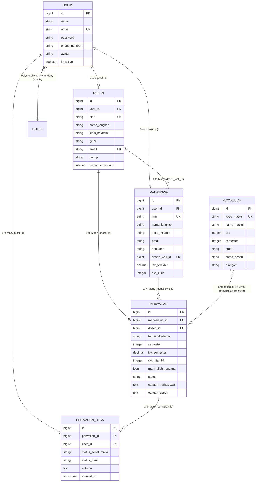

# 🎓 CAPSTONE PROJECT: SISTEM PENCATATAN PERWALIAN MAHASISWA STMIK BANDUNG

Aplikasi Fullstack Enterprise untuk **Sistem Pencatatan, Bimbingan Akademik, dan Persetujuan Perwalian Mahasiswa STMIK Bandung**. Dibangun dengan standar industri menggunakan arsitektur **Clean Architecture (Repository & Service Pattern)** pada Backend Laravel 10 (PHP 8.1 / PostgreSQL) dan **Modular Single Page Application (SPA)** pada Frontend React 18 (Vite, Vanilla CSS Glassmorphism, TanStack Query v5, Zustand, Recharts, Framer Motion, Sonner, SweetAlert2).

---

## 📌 DAFTAR ISI
1. [Gambaran Umum & Cara Kerja Aplikasi](#-gambaran-umum--cara-kerja-aplikasi)
2. [Siklus Hidup & Alur Bisnis Perwalian (Business Workflow)](#-siklus-hidup--alur-bisnis-perwalian-business-workflow)
3. [Arsitektur Sistem & Teknologi](#-arsitektur-sistem--teknologi)
4. [Fitur Lengkap Berdasarkan Hak Akses Role](#-fitur-lengkap-berdasarkan-hak-akses-role)
5. [Struktur Direktori Proyek](#-struktur-direktori-proyek)
6. [Panduan Instalasi & Menjalankan Aplikasi](#-panduan-instalasi--menjalankan-aplikasi)
7. [Daftar Kredensial Akun Testing (Database Seeder)](#-daftar-kredensial-akun-testing-database-seeder)
8. [Dokumentasi API Swagger OpenAPI](#-dokumentasi-api-swagger-openapi)
9. [Laporan Pengujian Fitur & Analisis Bug (Testing & Verification Report)](#-laporan-pengujian-fitur--analisis-bug-testing--verification-report)
10. [Pembaruan & Changelog Versi Terbaru](#-pembaruan--changelog-versi-terbaru)
11. [Dokumentasi Lanjutan (Master Backend & Frontend)](#-dokumentasi-lanjutan)

---

## 🌟 GAMBARAN UMUM & CARA KERJA APLIKASI

Sistem Pencatatan Perwalian STMIK Bandung dirancang untuk mendigitalisasi dan mengotomatisasi proses bimbingan akademik antara **Mahasiswa**, **Dosen Pembimbing Akademik (Dosen Wali)**, dan **Bagian Akademik/Administrator**.

### Masalah yang Diselesaikan:
* **Pencatatan Manual Rentan Hilang**: Menggantikan formulir kertas bimbingan fisik dengan sistem digital berbasis cloud.
* **Transparansi SKS & Mata Kuliah**: Menghindari kesalahan pengambilan SKS mahasiswa dengan kalkulasi SKS otomatis dan validasi batasan IPK.
* **Kemudahan Monitoring Dosen Wali**: Dosen dapat langsung memantau daftar mahasiswa asuhan, meninjau rencana studi, menyetujui, menolak, atau memberikan catatan revisi secara realtime.
* **Audit Trail Lengkap**: Setiap aksi (pengajuan, revisi, persetujuan, penolakan) tercatat dalam tabel riwayat log audit lengkap dengan timestamp dan identitas aktor.
* **Pelaporan & Rekapitulasi Cepat**: Administrator dan Dosen dapat mengunduh seluruh data dalam format **Excel (.xlsx)** dan **PDF (.pdf multi-halaman)** hanya dengan 1 kali klik.

---

## 🔄 SIKLUS HIDUP & ALUR BISNIS PERWALIAN (BUSINESS WORKFLOW)

```
[ MAHASISWA ]                           [ DOSEN WALI ]                        [ ADMINISTRATOR ]
      │                                       │                                       │
      ├──────► 1. Login Akun Mahasiswa        │                                       │
      │        (Cek Dosen Wali Aktif)         │                                       │
      │                                       │                                       │
      ├──────► 2. Input Pengajuan Perwalian   │                                       │
      │        - Pilih Semester               │                                       │
      │        - Input IPK Semester Lalu      │                                       │
      │        - Susun KRS Matkul (Dynamic)   │                                       │
      │        - Total SKS Terkalkulasi       │                                       │
      │        - Kirim ➔ Status: 'Pending'    │                                       │
      │                                       │                                       │
      │  (Bisa Edit/Hapus jika masih Pending) │                                       │
      │                                       │                                       │
      │                                       ├──────► 3. Login Dosen Wali            │
      │                                       │        (Melihat Notif Pending)        │
      │                                       │                                       │
      │                                       ├──────► 4. Review Pengajuan            │
      │                                       │        - Periksa SKS & Matkul         │
      │                                       │        - Beri Catatan Bimbingan       │
      │                                       │                                       │
      │                                       ├──────► 5. Keputusan Dosen:            │
      │                                       │        ├─► [DISETUJUI (Approve)]      │
      │                                       │        └─► [DITOLAK (Reject / Revisi)]│
      │                                       │                                       │
      ◄───────────────────────────────────────┴───────────────────────────────────────┤
      │ 6. Notifikasi & Riwayat Updated                                               │
      │    - Status berubah di Dashboard & Riwayat                                    │
      │    - Terkunci dari perubahan jika sudah Disetujui/Ditolak                     │
      │                                                                               │
      │                                                                               ├──────► 7. Monitoring Global
      │                                                                               │        - Dashboard Analitik
      │                                                                               │        - Assign Dosen Wali
      │                                                                               │        - Import/Export Data
      │                                                                               │        - Kelola Akun & Spatie
      │                                                                               │        - Kelola Mata Kuliah
```

### Rincian 4 Fase Utama:
1. **Fase Inisiasi (Admin & Sistem)**:
   * Administrator menginput/mengimpor data Mahasiswa dan Dosen.
   * Administrator menugaskan Dosen Wali kepada Mahasiswa (Assign Wali) sesuai kuota bimbingan.
   * Administrator mengelola daftar Mata Kuliah yang tersedia via modul Matakuliah.
2. **Fase Pengajuan (Mahasiswa)**:
   * Mahasiswa membuka menu **Pengajuan Perwalian**.
   * Memasukkan semester akademik, IPK semester sebelumnya, dan menyusun daftar mata kuliah secara dinamis via JSON builder.
   * Pengajuan tersimpan dengan status awal **`Pending`**. Selama berstatus Pending, mahasiswa berhak mengubah (Edit) atau membatalkan (Hapus) pengajuannya.
3. **Fase Peninjauan & Keputusan (Dosen Wali)**:
   * Dosen Wali melihat notifikasi counter antrean perwalian pada Dashboard dan tabel perwalian.
   * Dosen membuka modal review, memeriksa beban SKS terhadap IPK, menuliskan masukan bimbingan, lalu memilih keputusan **`Disetujui`** atau **`Ditolak`**.
   * Sistem otomatis mencatat log riwayat, mengisi `tgl_persetujuan`, dan mengunci formulir.
4. **Fase Evaluasi & Pelaporan (Seluruh Role)**:
   * Mahasiswa dan Dosen melihat linimasa kronologis di menu **Riwayat Bimbingan**.
   * Admin dan Dosen dapat mengekspor rekapitulasi data perwalian ke file Excel dan PDF.

---

## 🏗️ ARSITEKTUR SISTEM & TEKNOLOGI

### 1. Backend: Clean Architecture Laravel 10 (PHP 8.1 / PostgreSQL)
* **Design Pattern**: Repository & Service Pattern untuk pemisahan tanggung jawab (Separation of Concerns).
* **Routes (`routes/api.php`)**: Endpoint REST API ber-prefix `/api/v1` dengan proteksi middleware Sanctum dan Spatie Permission.
* **Form Requests (`app/Http/Requests/`)**: Validasi input ketat dengan pesan kesalahan **Bahasa Indonesia** (NIM unik, format email institusi, tipe data, dll).
* **Controllers (`app/Http/Controllers/Api/v1/`)**: Menerima request HTTP dan mengembalikan standarisasi JSON (`ApiResponseTrait`).
* **Services (`app/Services/`)**: Pusat logika bisnis (validasi kuota dosen, kalkulasi status perwalian, pembuatan audit log).
* **Repositories (`app/Repositories/`)**: Lapisan akses basis data dengan Eloquent ORM, filter multi-kriteria, dan operator `ILIKE` case-insensitive.
* **Resources (`app/Http/Resources/`)**: Transformasi struktur respon JSON yang aman dan konsisten.
* **Authentication & Security**: Laravel Sanctum Bearer Token & Spatie Laravel Permission Guard.
* **Exception Handler**: Pesan error HTTP 401/403/404 terpusat dalam **Bahasa Indonesia** yang ramah pengguna.

### 2. Frontend: Modular Single Page Application (React 18 + Vite)
* **Build Tool**: Vite (Super cepat, Hot Module Replacement).
* **Styling**: Vanilla CSS dengan Glassmorphism effect dan Dark Mode toggle.
* **State Management**:
  * **Zustand (`authStore`, `themeStore`)**: Manajemen state autentikasi pengguna dan preferensi tema dengan persistensi `localStorage`.
  * **TanStack React Query v5**: Server state management, auto caching, background refetching, dan instant mutation invalidation.
* **Routing & Guards**: React Router DOM v6 (`ProtectedRoute` untuk cek token, `RoleRoute` untuk otorisasi hak akses 403).
* **Komponen & Visualisasi**:
  * **Recharts**: Bar Chart (distribusi semester) & Pie Chart (proporsi status perwalian).
  * **Lucide React**: Icon set modern dan konsisten.
  * **Sonner Toast & SweetAlert2**: Feedback notifikasi dan konfirmasi dialog **sepenuhnya Bahasa Indonesia**.
  * **jsPDF & XLSX**: Generator ekspor file PDF dan Excel instan langsung dari browser.

---

## 🗄️ SKEMA BASIS DATA & DIAGRAM RELASI (ERD)

Berikut adalah diagram relasi entitas (*Entity-Relationship Diagram*) lengkap sistem perwalian di basis data PostgreSQL:



### Rangkuman Kardinalitas Relasi:
* **`users` ➔ `dosen`** (*1-to-1*): 1 akun login terhubung ke 1 profil data dosen.
* **`users` ➔ `mahasiswa`** (*1-to-1*): 1 akun login terhubung ke 1 data mahasiswa.
* **`dosen` ➔ `mahasiswa`** (*1-to-Many*): 1 Dosen Wali membimbing banyak mahasiswa.
* **`mahasiswa` ➔ `perwalian`** (*1-to-Many*): 1 Mahasiswa memiliki riwayat pengajuan perwalian tiap semester.
* **`dosen` ➔ `perwalian`** (*1-to-Many*): 1 Dosen Wali memvalidasi pengajuan dari seluruh mahasiswa asuhannya.
* **`perwalian` ➔ `perwalian_logs`** (*1-to-Many*): 1 pengajuan perwalian memiliki linimasa jejak perubahan status (Audit Trail).

---

## 👥 FITUR LENGKAP BERDASARKAN HAK AKSES ROLE

### 🎓 1. Mahasiswa
* **Dashboard Mahasiswa**:
  * Widget statistik: Total Perwalian, Pending, Disetujui, Ditolak.
  * Kartu Informasi Dosen Wali (Nama, NIDN, Email, No. WhatsApp).
  * Status Pengajuan Perwalian Aktif (Semester, IPK, SKS, Tanggal Pengajuan, Catatan Dosen).
* **Pengajuan Perwalian Baru**:
  * Form semester & input IPK semester sebelumnya.
  * **Dynamic KRS Builder**: Tombol tambah/hapus baris mata kuliah dinamis (Kode, Nama Matkul, SKS, Kelas).
  * Kalkulasi total SKS otomatis realtime.
  * Kolom catatan/kendala akademik mahasiswa.
* **Pengelolaan Status Pending**:
  * Edit data pengajuan perwalian jika masih berstatus `Pending`.
  * Hapus (Batalkan) pengajuan perwalian jika masih berstatus `Pending`.
* **Riwayat Bimbingan**: Linimasa kronologis per semester beserta status approval dan catatan evaluasi Dosen Wali.
* **Profil Pengguna**: Lihat biodata, ubah foto profil, dan perbarui data profil (Nama, Email, Nomor Telepon/WhatsApp).
* **Ekspor Rekap Perwalian**: Download rekap perwalian **milik sendiri** ke file Excel atau PDF.

### 👨‍🏫 2. Dosen Pembimbing Akademik / Dosen Wali
* **Dashboard Dosen Wali**:
  * Widget statistik: Total Mahasiswa Bimbingan, Butuh Persetujuan (Pending), Disetujui, Ditolak.
  * Tabel aksi cepat pengajuan perwalian yang menunggu tindakan dosen.
* **Daftar & Peninjauan Perwalian**:
  * Filter daftar perwalian berdasarkan status dan semester.
  * **Modal Review & Persetujuan**: Memeriksa rencana matakuliah, memilih keputusan (`Disetujui` / `Ditolak`), serta mengisi catatan bimbingan akademik.
* **Daftar Mahasiswa Bimbingan**: Memantau daftar mahasiswa asuhan, NIM, Program Studi, Angkatan, IPK terakhir, dan total SKS yang telah ditempuh.
* **Riwayat Approval & Audit Trail**: Memeriksa riwayat historis seluruh perwalian yang pernah ditinjau.
* **Ekspor Laporan**: Download data perwalian bimbingan **mahasiswa asuhan sendiri** ke format Excel dan PDF (scoped by dosen).

### 🛡️ 3. Administrator
* **Dashboard Utama Administrator**:
  * Statistik global: Total Mahasiswa, Total Dosen Wali, Total Transaksi Perwalian.
  * **Grafik Analitik Recharts**: Bar Chart per semester dan Donut/Pie Chart status perwalian.
  * Linimasa *Recent Activity Logs* seluruh aktivitas sistem secara realtime.
* **Manajemen Mata Kuliah** *(Modul Baru)*:
  * CRUD Data Mata Kuliah (Tambah, Edit, Hapus).
  * **Kode Matkul Auto-Sequential Dropdown**: Sistem otomatis mendeteksi kode terakhir per Prodi & Semester dan menyarankan kode berikutnya (contoh: jika `IF-303` ada, dropdown menyarankan `IF-304 ★`).
  * **Dropdown Ruangan**: Pilihan ruang kuliah standar STMIK Bandung (Lab IF-1, Lab IF-2, Lab Multimedia, Ruang 101, dll).
  * Pencarian & filter berdasarkan Prodi dan Semester.
  * Ekspor data mata kuliah ke Excel dan PDF.
* **Manajemen Mahasiswa**:
  * CRUD Lengkap Mahasiswa (Tambah, Edit, Hapus dengan konfirmasi SweetAlert2).
  * Pencarian instan (NIM / Nama) dan filter Program Studi.
  * **Import Data Massal**: Fitur import data mahasiswa baru via format JSON.
  * **Export Multi-Halaman**: Download seluruh data mahasiswa ke format Excel dan PDF.
* **Manajemen Dosen Wali**:
  * CRUD Data Dosen Wali dan pengaturan kuota maksimal bimbingan.
  * **Assign Dosen Wali**: Penugasan dosen wali secara massal (bulk assign) kepada mahasiswa yang belum memiliki pembimbing.
  * **Autocomplete Dosen Pengampu**: Field dosen pengampu di mata kuliah menggunakan `<datalist>` suggestion dari daftar dosen aktif.
* **Rekapitulasi Perwalian**:
  * Monitoring seluruh transaksi perwalian lintas program studi dan angkatan.
  * Export Rekapitulasi Perwalian ke Excel dan PDF.
* **Kelola User & Role Spatie** *(Fitur Ditingkatkan)*:
  * Manajemen akun pengguna sistem (Admin, Dosen, Mahasiswa).
  * **Pembuatan Akun Dinamis**: Saat membuat akun Mahasiswa, muncul field NIM, Prodi, Angkatan, dan **Dosen Wali langsung bisa dipilih**. Saat membuat akun Dosen, muncul field NIDN dan Gelar.
  * Tambah akun baru, edit data, ganti role Spatie, dan hapus akun.
* **Pengaturan Sistem**: Pengaturan visual tema (Dark Mode / Light Mode).

---

## 📁 STRUKTUR DIREKTORI PROYEK

```
WEB/
├── backend/                         # Backend Laravel 10 REST API
│   ├── app/
│   │   ├── Exceptions/
│   │   │   └── Handler.php          # Exception handler dengan pesan Bahasa Indonesia (401/403/404)
│   │   ├── Http/
│   │   │   ├── Controllers/Api/v1/  # Auth, Dashboard, Mahasiswa, Dosen, Perwalian, User, Matakuliah, ExportImport
│   │   │   ├── Requests/            # Form Validation Requests dengan pesan Bahasa Indonesia
│   │   │   │   ├── Auth/            # LoginRequest, UpdateProfileRequest, ForgotPasswordRequest
│   │   │   │   ├── Dosen/           # StoreDosenRequest, UpdateDosenRequest, AssignDosenWaliRequest
│   │   │   │   ├── Mahasiswa/       # StoreMahasiswaRequest, UpdateMahasiswaRequest
│   │   │   │   └── Perwalian/       # StorePerwalianRequest, UpdatePerwalianRequest, ApproveRejectPerwalianRequest
│   │   │   └── Resources/           # API JSON Transformers
│   │   ├── Interfaces/              # Repository Interface Contracts
│   │   ├── Models/                  # User, Mahasiswa, Dosen, Matakuliah, Perwalian, PerwalianLog
│   │   ├── Repositories/Eloquent/   # Data Access Layer (PostgreSQL / Eloquent)
│   │   ├── Services/                # Business Logic Layer
│   │   │   ├── AuthService.php
│   │   │   ├── DosenService.php
│   │   │   ├── ExportImportService.php  # Scoped export (per role mahasiswa/dosen)
│   │   │   ├── MahasiswaService.php
│   │   │   ├── PerwalianService.php
│   │   │   └── UserService.php          # Transactional create/update User + Mahasiswa/Dosen
│   │   └── Traits/                  # ApiResponseTrait (Standarisasi JSON)
│   ├── database/
│   │   ├── migrations/              # Skema tabel database PostgreSQL (termasuk tabel matakuliah)
│   │   └── seeders/DatabaseSeeder.php # Seeder 1 Admin, 5 Dosen, 50 Mahasiswa, 100 Perwalian, Matakuliah
│   ├── routes/api.php               # Rute API v1 (termasuk route /matakuliah)
│   └── tests/Feature/               # 10 Automated PHPUnit Feature Tests
│
├── frontend/                        # Frontend React 18 Single Page Application
│   ├── src/
│   │   ├── components/
│   │   │   ├── common/              # Button, Input, Select, Modal, Card, Badge, Skeleton, EmptyState, ErrorBoundary
│   │   │   ├── dashboard/           # StatCard, ChartCards (Recharts), ActivityTimeline
│   │   │   └── layout/              # Sidebar (Role-based), Navbar, Footer, PageHeader
│   │   ├── layouts/                 # AuthLayout, DashboardLayout
│   │   ├── pages/
│   │   │   ├── auth/                # Login, RegisterAdmin, ForgotPassword, ResetPassword
│   │   │   ├── dashboard/           # DashboardPage (Multi-role views)
│   │   │   ├── mahasiswa/           # MahasiswaListPage (CRUD, Search, Filter, Import, Export)
│   │   │   ├── dosen/               # DosenListPage (CRUD, Assign Wali, Monitoring)
│   │   │   ├── matakuliah/          # MatakuliahListPage (CRUD, Auto-Sequential Code, Room Dropdown)
│   │   │   ├── perwalian/           # PerwalianListPage (Dynamic KRS Builder, Review Modal, Scoped Export)
│   │   │   ├── riwayat/             # RiwayatPage (Audit Trail Timeline)
│   │   │   ├── profile/             # ProfilePage (Foto Upload, Profil Dosen Wali)
│   │   │   ├── settings/            # SettingsPage, UserManagementPage (Dynamic NIM/NIDN fields)
│   │   │   └── errors/              # Error403, Error404, Error500
│   │   ├── routes/                  # AppRoutes, ProtectedRoute, RoleRoute
│   │   ├── services/                # Axios Client API Services
│   │   │   ├── api.js               # Axios instance + interceptors
│   │   │   ├── authService.js
│   │   │   ├── dashboardService.js
│   │   │   ├── dosenService.js
│   │   │   ├── mahasiswaService.js
│   │   │   ├── matakuliahService.js # Baru: CRUD mata kuliah
│   │   │   ├── perwalianService.js  # Export dengan parameter scope
│   │   │   └── userService.js
│   │   ├── store/                   # Zustand (authStore, themeStore)
│   │   └── utils/                   # exportHelpers (Excel/PDF), formatters
│   └── index.html
│
├── README.md                        # Master Overview & Tutorial Lengkap (File ini)
├── README-BACKEND.md                # Dokumentasi Teknis Mendalam Backend
└── README-FRONTEND.md               # Dokumentasi Teknis Mendalam Frontend
```

---

## 🚀 PANDUAN INSTALASI & MENJALANKAN APLIKASI

### Prasyarat Sistem:
* **PHP**: Versi `>= 8.1` (Ekstensi `pdo`, `pdo_pgsql` / `pdo_sqlite`, `openssl`, `mbstring` aktif)
* **Composer**: Versi `>= 2.2`
* **Node.js**: Versi `>= 18.0.0` & **npm**
* **Database**: PostgreSQL (atau SQLite untuk testing)

---

### Langkah 1: Setup & Menjalankan Backend (Laravel API)

1. Buka terminal dan masuk ke folder `backend`:
   ```bash
   cd backend
   ```
2. Salin environment configuration file:
   ```bash
   cp .env.example .env
   ```
3. Sesuaikan konfigurasi database pada file `.env`:
   ```env
   DB_CONNECTION=pgsql
   DB_HOST=127.0.0.1
   DB_PORT=5432
   DB_DATABASE=db_perwalian_stmik
   DB_USERNAME=postgres
   DB_PASSWORD=password_anda

   APP_URL=http://127.0.0.1:8000
   L5_SWAGGER_CONST_HOST=http://127.0.0.1:8000/api/v1
   ```
4. Install dependensi composer:
   ```bash
   composer install
   ```
5. Generate Application Key:
   ```bash
   php artisan key:generate
   ```
6. Jalankan Migrasi Database dan Seeder Awal:
   ```bash
   php artisan migrate:fresh --seed
   ```
   *(Perintah ini akan membuat semua tabel dan mengisinya dengan 1 Admin, 5 Dosen Wali, 50 Mahasiswa, 100 Data Transaksi Perwalian, dan data Mata Kuliah contoh).*
7. Jalankan Server Backend Laravel:
   ```bash
   php artisan serve --host=127.0.0.1 --port=8000
   ```
   * **Base API URL**: `http://127.0.0.1:8000/api/v1`
   * **Swagger OpenAPI Docs**: `http://127.0.0.1:8000/api/documentation`

---

### Langkah 2: Setup & Menjalankan Frontend (React SPA)

1. Buka terminal baru dan masuk ke folder `frontend`:
   ```bash
   cd frontend
   ```
2. Install dependensi Node.js:
   ```bash
   npm install
   ```
3. Jalankan Vite Development Server:
   ```bash
   npm run dev
   ```
4. Buka browser pada alamat:
   ```
   http://localhost:5173
   ```

---

## 🔑 DAFTAR KREDENSIAL AKUN TESTING (DATABASE SEEDER)

Seluruh akun berikut otomatis dibuat saat menjalankan perintah `php artisan migrate:fresh --seed`:

| No | Role Akses | Login (Email / NIDN) | Password Default | Fitur Utama yang Dapat Dicoba |
|:---:|:---|:---|:---:|:---|
| **1** | **Administrator** | Email: `admin@stmikbandung.ac.id` | `Admin123` | Dashboard Analitik (Recharts Bar/Pie), CRUD & Import Mahasiswa, CRUD & Assign Dosen Wali, **Kelola Mata Kuliah (Kode Auto)**, Rekap Perwalian, Kelola User & Hak Akses Spatie, Export Excel/PDF |
| **2** | **Dosen Wali (1)** | NIDN: `0401018501` *(Dr. Irwan Setiawan, M.T.)* | `Dosen123` | Dashboard Bimbingan, Review & Approve/Reject Perwalian Mahasiswa Bimbingan, Catatan Dosen, Monitoring Mahasiswa Asuhan, Export Rekap (Scoped) |
| **3** | **Dosen Wali (2)** | NIDN: `0412058802` *(Hj. Nurasiah, M.Kom.)* | `Dosen123` | Dashboard Bimbingan, Approval Perwalian Mahasiswa Asuhan Dosen 2 |
| **4** | **Dosen Wali (3)** | NIDN: `0420087903` *(Budi Raharjo, Ph.D.)* | `Dosen123` | Dashboard Bimbingan, Approval Perwalian Mahasiswa Asuhan Dosen 3 |
| **5** | **Dosen Wali (4)** | NIDN: `0415119004` *(Rina Andriani, S.Kom., M.T.)* | `Dosen123` | Dashboard Bimbingan, Approval Perwalian Mahasiswa Asuhan Dosen 4 |
| **6** | **Dosen Wali (5)** | NIDN: `0408038305` *(Ahmad Fauzi, M.Si.)* | `Dosen123` | Dashboard Bimbingan, Approval Perwalian Mahasiswa Asuhan Dosen 5 |
| **7** | **Mahasiswa (1)** | Email: `1222001@student.stmikbandung.ac.id` | `Mahasiswa123` | Dashboard Mahasiswa, Info Dosen Wali, Pengajuan Perwalian Baru (Dynamic KRS Builder), Edit/Hapus Status Pending, Linimasa Riwayat Bimbingan, **Export Rekap Sendiri** |
| **8** | **Mahasiswa (2)** | Email: `3222001@student.stmikbandung.ac.id` | `Mahasiswa123` | Dashboard & Pengajuan Perwalian Mahasiswa 2 |
| **...**| **Mahasiswa (3–20)** | Email: `{nim}@student.stmikbandung.ac.id` | `Mahasiswa123` | Masing-masing akun mahasiswa terhubung ke salah satu dari 5 Dosen Wali secara merata |

> ⚠️ **Cara Login**: Admin & Mahasiswa gunakan **Email**. Dosen gunakan **NIDN** (angka saja, tanpa @).


---

## 📖 DOKUMENTASI API SWAGGER OPENAPI

Backend telah dilengkapi dengan dokumentasi interaktif **L5-Swagger OpenAPI 3.0**.

* **URL Swagger UI**: `http://127.0.0.1:8000/api/documentation`
* **Fitur Swagger**:
  * Anotasi komentar PHP OpenAPI (`@OA\Get`, `@OA\Post`, `@OA\Put`, `@OA\Delete`) pada seluruh Controller.
  * Tombol **Authorize** untuk menguji endpoint terproteksi dengan memasukkan token Bearer Sanctum.
  * Skema Request Body & Model Response JSON terdokumentasi lengkap.
* **Perintah Regenerasi Dokumentasi Swagger**:
  ```bash
  cd backend
  php artisan l5-swagger:generate
  ```

---

## 🧪 LAPORAN PENGUJIAN FITUR & ANALISIS BUG (TESTING & VERIFICATION REPORT)

### 1. Hasil Automated Testing PHPUnit Backend (`php artisan test`)
```text
   PASS  Tests\Unit\ExampleTest
  ✓ that true is true

   PASS  Tests\Feature\AuthenticationTest
  ✓ user can login with valid credentials
  ✓ user cannot login with invalid password

   PASS  Tests\Feature\ExampleTest
  ✓ the application returns a successful response

   PASS  Tests\Feature\MahasiswaCrudTest
  ✓ admin can create mahasiswa

   PASS  Tests\Feature\MatakuliahTest
  ✓ user can get all matakuliah

   PASS  Tests\Feature\PasswordResetTest
  ✓ user can request forgot password and token expires in 5 minutes
  ✓ expired token after 5 minutes is rejected

   PASS  Tests\Feature\PermissionTest
  ✓ mahasiswa cannot access admin dashboard

   PASS  Tests\Feature\PerwalianWorkflowTest
  ✓ mahasiswa can create perwalian

  Tests:    10 passed (30 assertions)
  Status:   100% PASSED
```

### 2. Hasil Verifikasi Frontend Build (`npm run build`)
```text
  ✓ 3205 modules transformed
  ✓ built in 3.50s
  dist/index.html                          0.49 kB
  dist/assets/index.css                   43.68 kB
  dist/assets/index.js                 1,922.30 kB
  Status: 0 Error, 0 Warning Kritis
```

---

## 🆕 PEMBARUAN & CHANGELOG VERSI TERBARU

### Versi Terkini — Agustus 2026

#### ✅ Fitur Baru yang Ditambahkan:

| Modul | Perubahan |
|:---|:---|
| **Mata Kuliah (Backend)** | Tambah `MatakuliahController`, `MatakuliahService`, `MatakuliahRepository`, model `Matakuliah`, route `/api/v1/matakuliah` |
| **Mata Kuliah (Frontend)** | Halaman `MatakuliahListPage.jsx` dengan CRUD penuh, kode auto-sequential dropdown, dropdown ruangan standar, filter Prodi & Semester |
| **User Management** | Field NIM + Prodi + Angkatan + pilih Dosen Wali langsung muncul saat Role = Mahasiswa; Field NIDN + Gelar muncul saat Role = Dosen |
| **Export Perwalian** | Export sekarang di-*scope* per role: Mahasiswa hanya bisa export datanya sendiri; Dosen hanya bisa export mahasiswa bimbingannya |
| **Validasi Bahasa Indonesia** | Seluruh Form Request backend sudah memiliki `messages()` Bahasa Indonesia yang jelas |
| **Exception Handler** | Error HTTP 401 (Unauthenticated), 403 (Unauthorized), 404 (Not Found) kini menggunakan pesan Bahasa Indonesia |
| **Bug Fix** | Diperbaiki error `Attempt to read property "id" on string` pada `UpdateMahasiswaRequest` dan `UpdateDosenRequest` saat mengakses route parameter |
| **Route Guard** | Akses URL langsung (misal `/matakuliah`) saat login sebagai Dosen atau Mahasiswa dialihkan ke halaman 403 |
| **Format NIM Resmi STMIK** | Teknik Informatika berawalan `12`, Sistem Informasi berawalan `32` + 2 digit tahun masuk (contoh: 2026 ➔ `26`) + nomor urut `01`, `02`, dst. Ditambahkan endpoint `/api/v1/mahasiswa/generate-nim` dan generator auto-fill cerdas pada frontend |
| **Dosen Pengampu** | Field dosen pengampu pada form mata kuliah menggunakan `<datalist>` autocomplete dari daftar dosen master + riwayat pengampu |
| **Notifikasi** | Seluruh toast notification di frontend kini menggunakan Bahasa Indonesia yang sopan dan informatif |

---

## 📚 DOKUMENTASI LANJUTAN

Untuk panduan teknis mendalam per layer sistem, silakan merujuk ke dokumen berikut:
* 💻 **[README-BACKEND.md](./README-BACKEND.md)** — Panduan Clean Architecture, Model Relasional, Swagger Annotations, Seeders, dan Unit Testing.
* 🎨 **[README-FRONTEND.md](./README-FRONTEND.md)** — Panduan Desain Sistem, Manajemen Rute & Guard, Zustand Store, Recharts, Builder KRS, Modul Matakuliah, dan Ekspor Laporan.

---

## 👨‍💻 PENGEMBANG & LISENSI
Diproduksi sebagai **Fullstack Capstone Project Enterprise STMIK Bandung**.
Lisensi di bawah kepemilikan STMIK Bandung. Dilindungi oleh hak cipta.
